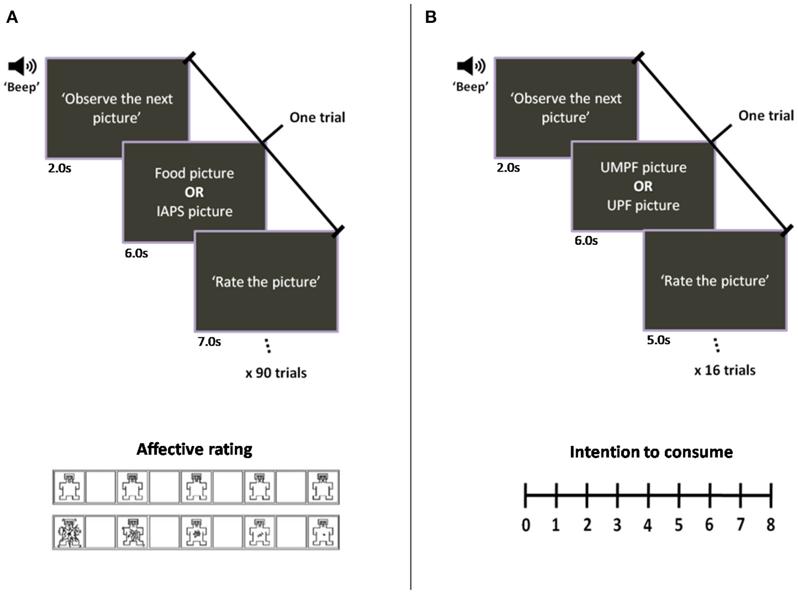

## 1. Manuscript Selection

Our group used Mendeley Data to search for open datasets we could reanalyze. After searching, we landed on data from the article ***Ultra-Processed Foods Elicit Higher Approach Motivation Than Unprocessed and Minimally Processed Foods*** by Lemos et al. (2022). Three datasets were provided looking at different aspects of the research, which worked well for our group. Additionally, the data was already well organized and formatted, allowing us to easily reconstruct and reanalyze graphs based.

The main objective of the paper and datasets chosen were to determine whether ultra-processed food elicited stronger emotional responses and motivations compared to unprocessed or minimally processed foods. Additionally, they aimed to see whether these emotional responses influenced people's intentions to consume those foods.

## 2. Understanding the Study

The data in this study represent how participants emotionally and behaviorally responded to images of different types of foods. Participants were shown pictures of ultra-processed foods (UPF) and unprocessed or minimally processed foods (UMPF), along with additional standard images used to measure emotional reactions. For each image, participants rated how they felt using two main measures: pleasantness (how positive or negative the image seemed) and arousal (how exciting the image felt). These ratings were recorded as numerical values, creating a dataset that reflects emotional responses to each type of food. In a second task, participants also rated their intention to consume the foods shown. Together, these data allow for comparisons between UPF and UMPF and help show how emotional responses may influence a person’s desire to eat certain foods.

## 3. Original Figures and Tables (Critique)

-   What the authors did
-   Strengths
-   Weakness

The authors created schematic representations of the sequence of events in the trial. They utilized timelines to show the order pictures were shown and how long panelists had to respond. These figures could have been simplified to better express the objectives of the study. The scale for affective rating and the figures used seem abstract and do not contribute to reader understanding.

Additionally, no graphs or tables were included to visually represent the results of the study. Some visualization of the data collected would aid the reader in understanding the results.

{fig-align="center" width="85%"}

## 4. Data Processing

Using AI tools like ChatGPT and Claude by Anthropic, we were able to clean our data, making it simpler to create plots in rStudio. Below are the following changes and transformations made to data:

Dataset 1 changes: I restructured the data to create four graphs based on pleasantness of and arousal ratings for ultra-processed and unprocessed foods. I wanted to further divide each food featured in the questions into its own food category. I thought this made for some interesting comparisons within group, as well as across groups.

Dataset 2 changes:

Dataset 3 changes: I wanted to clearly be able to see from a numerical value whether consumers had higher intentions to choose ultra- or minimally processed foods, which the original data did not show. With help from ChatGPT, I added a column to my data that determined whether consumers preferred ultraprocessed or minimally processed foods from the positive or negative delta value. Additionally, all data was cleaned to remove missing or incomplete values and ensure that any categorical values matched.

## 5. Recreated Figures

Datset 1 plots:


```{r}
#| label: load-data
#| message: false
#| warning: false

library(readxl)
library(dplyr)

file_path <- "data/Mendeley_dataset_table_1.xlsx"

col_names <- c("Item", "Pleasantness_Mean", "Pleasantness_SD", "Arousal_Mean", "Arousal_SD")

upf <- read_excel(file_path, sheet = "Table1b_UltraProcessed",
                  skip = 2, col_names = col_names) %>%
  mutate(
    Pleasantness_Mean = as.numeric(Pleasantness_Mean),
    Arousal_Mean      = as.numeric(Arousal_Mean),
    Category = case_when(
      Item %in% c("nugget", "bacon", "sausage", "hot dog",
                  "cooked pork salami")                          ~ "Meat & Protein",
      Item %in% c("potato chips", "tortilla chips", "starch chips",
                  "microwave popcorn", "corn chips")             ~ "Snacks & Chips",
      Item %in% c("chocolate bar", "gums", "ice cream",
                  "chocolate-covered marshmallow", "popsicle",
                  "jelly", "cookie", "cookie stuffed with chocolate",
                  "cookie stuffed with vanilla", "chocolate discs",
                  "wafer cookies")                               ~ "Sweets & Confectionery",
      Item %in% c("ready-to-eat pizza", "hamburguer",
                  "ready-to-eat lasagna", "instant noodles")     ~ "Fast Food & Meals",
      Item %in% c("breakfast cereals", "brazilian cheese bread",
                  "panettone with milk jam cream")               ~ "Bread & Cereals",
      Item %in% c("grape soda", "ready-to-drink chocolate milk",
                  "coke soda")                                   ~ "Beverages",
      TRUE                                                       ~ "Other"
    )
  ) %>%
  mutate(Category = factor(Category, levels = c(
    "Meat & Protein", "Fast Food & Meals", "Snacks & Chips",
    "Sweets & Confectionery", "Bread & Cereals", "Beverages", "Other"
  )),
  Item = reorder(Item, as.numeric(Category) * 100 + rank(Item)))

umpf <- read_excel(file_path, sheet = "Table1c_UnprocessedFood",
                   skip = 2, col_names = col_names) %>%
  mutate(
    Pleasantness_Mean = as.numeric(Pleasantness_Mean),
    Arousal_Mean      = as.numeric(Arousal_Mean),
    Category = case_when(
      Item %in% c("watermelon", "apple", "kiwi", "strawberry", "grape",
                  "papaya", "pineapple*", "pear", "mango", "apricot",
                  "orange", "peach", "banana")                   ~ "Fruit",
      Item %in% c("salad", "salad*", "lettuce", "cherry tomato",
                  "broccoli", "potato", "string beans", "carrot",
                  "kale", "corn")                                ~ "Vegetables",
      Item %in% c("beef", "salmon", "egg")                      ~ "Meat, Fish & Eggs",
      Item %in% c("cashew nut", "bean")                         ~ "Nuts & Legumes",
      Item %in% c("tapioca", "brazilian lunch")                  ~ "Grains & Meals",
      Item %in% c("mandarin juice", "coconut water")             ~ "Beverages",
      TRUE                                                       ~ "Other"
    )
  ) %>%
  mutate(Category = factor(Category, levels = c(
    "Meat, Fish & Eggs", "Fruit", "Vegetables",
    "Nuts & Legumes", "Grains & Meals", "Beverages", "Other"
  )),
  Item = reorder(Item, as.numeric(Category) * 100 + rank(Item)))
library(tidyverse)
library(usethis)
library(ggplot2)
library(dplyr)
library(tidyr)

plot_bar <- function(data, y_var, title, y_label, fill_color) {
  ggplot(data, aes(x = Category, y = .data[[y_var]])) +
    geom_bar(stat = "identity", fill = fill_color) +
    labs(title = title, y = y_label, x = "Category") +
    theme_minimal()
}
#| label: fig-upf-pleasantness
#| fig-cap: "Mean pleasantness ratings for ultra-processed food items, grouped by category."
#| fig-width: 16
#| fig-height: 6
#| warning: false

plot_bar(upf, "Pleasantness_Mean",
         "Pleasantness – Ultra-Processed Foods",
         "Mean Pleasantness", "#E07B54")
```

Dataset 2 plots:

Dataset 3 plots:

```{r}
library(tidyverse)
library(usethis)
library(ggplot2)
library(dplyr)
library(tidyr)

food_data <- read.csv("food_data.csv")

direction_summary <- food_data %>%
  filter(Food_Type == "Unprocessed") %>%
  count(Direction)

unique(direction_summary$Direction)
direction_summary$Direction <- factor(direction_summary$Direction)

p1 <- ggplot(direction_summary, aes(x = Direction, y = n, fill = Direction)) +
  geom_col(width = 0.6, color = "black") +
   scale_x_discrete(labels = c(
    "Prefers_Ultraprocessed" = "Ultraprocessed",
    "Prefers_Unprocessed" = "Unprocessed",
    "No_Preference" = "No Preference"
  )) +
  scale_fill_manual(values = c(
    "Prefers_Unprocessed" = "#4caf50",
    "Prefers_Ultraprocessed" = "red4",
    "No_Preference" = "slategray2"
  )) +
  scale_y_continuous(
    breaks = seq(0, max(direction_summary$n), by = 15)
  ) +
  labs(
    title = "Number of Participants by Preference",
    x = "Preference Direction",
    y = "Number of Participants") +
  theme_minimal(base_size = 13) +
  theme(
    legend.position = "none",
    plot.title = element_text(family = "Arial", size = 16, face = "bold"),
    axis.title = element_text(family = "Arial", size = 14),
    axis.text = element_text(family = "Arial", size = 12)
    )

print(p1)
```

```{r}

delta_data <- food_data %>% filter(Food_Type == "Unprocessed")

p3 <- ggplot(delta_data, aes(x = Delta)) +
  geom_histogram(binwidth = 0.5, boundary = 0,
                 linewidth = 0.3) +
  geom_vline(xintercept = 0, linetype = "dashed", color = "gray30") +
  geom_vline(xintercept = mean(delta_data$Delta),
              color = "black", linewidth = 1) +
  scale_x_continuous(breaks = seq(floor(min(delta_data$Delta)),
                                  ceiling(max(delta_data$Delta)),
                                  by = 1)) +
  aes(fill = Delta > 0) +
  scale_fill_manual(values = c("TRUE" = "red4", "FALSE" = "#4caf50")) +
  labs(
    title = "Participant Preference Strength Distribution",
    subtitle = "Positive = Favors Ultraprocessed | Negative = Favors Unprocessed",
    x = "Preference Score (Ultraprocessed - Unprocessed)",
    y = "Number of Participants"
  ) +
  theme_minimal(base_size = 13) +
  theme(
    plot.title = element_text(family = "Arial", size = 16, face = "bold"),
  )

print(p3)

```
